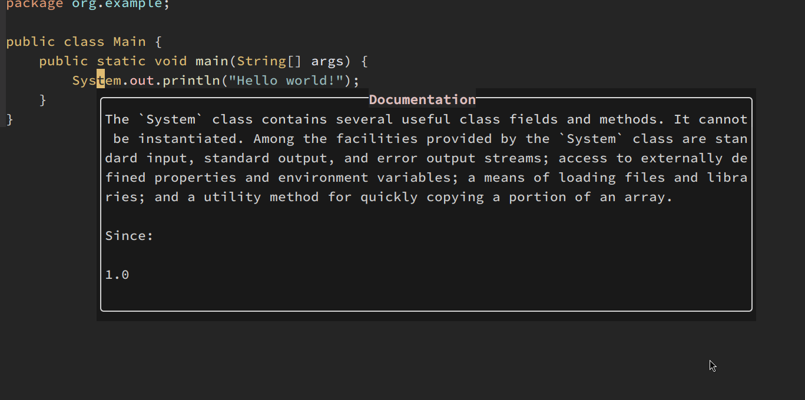
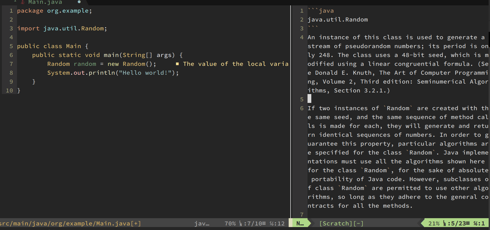
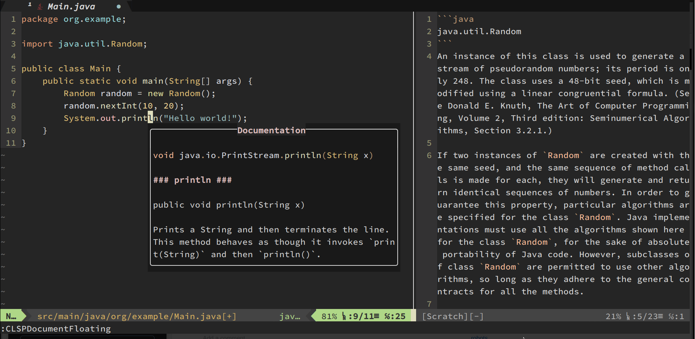
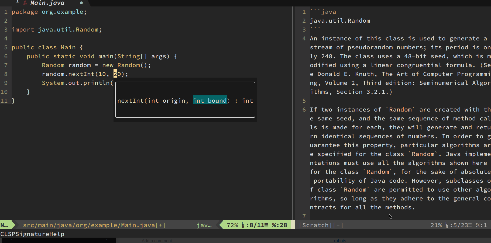

# VIM-CLSP 

Simple / hacky VIM LSP front-end.

## Introduction

This is a hacky Vim-LSP front-end plugin. I'm not an expert on neovim / lua, so I just put a bunch of goggled codes that works for my own scenario.

I really like the simplicity and design simplicity around VIM-built in functionality like Quickfix window. So I don't like plugins that is too specific for a particular language, or too fancy that changes the core behavior of vim / neovim.

This plugin only do the following four things:

1. Expose some LSP lua function to user command, so I can call them more easily.
2. Adjust the built-in signature helper function, so it could be semi transparent (winblend), and:
    2.1 Make the behavior more sensible, for example, run `:CLSPSignatureHelp` twice will close the already opened window instead of focus to it.
    2.2 Add a simple user command `:CLSPSignatureHelpToggleAlwaysOn` to toggle if the signature helper window should show up when `CursorHold`.
3. Provide a more sensible floating documentation viewer (vim.lsp.buf.hover).
    3.1 Run ':CLSPDocumentationFloating' twice will close the window.
    3.2 Add key binding to foucs / close / navigate the floating window.
4. Provide a command to open documentation in (v)split window.

If you are looking for something that's more advanced, [trouble.vim](https://github.com/folke/trouble.nvim) might be a better choice.

## Screenshot






## Installation

You could install it with plugin manager like [vim-plug](https://github.com/junegunn/vim-plug)

```
Plug 'brianhsu/vim-clsp'
```

## Setup / Configuration

You could initialize this plugin by add the following lines in your `init.lua`.

```lua
local clsp = require('vim-clsp')
clsp.setup({})
```

The following are the default settings, you could provide your own to override. Everything is optional, if you don't specify it, it will use the default.

```lua
local clsp = require('vim-clsp')
clsp.setup({
  floating_document_viewer = {
    win_blend = 15,
    win_config = {
title = "Documentation",
      border = "rounded",
      width_calculator = function()
        return math.floor(vim.api.nvim_win_get_width(vim.api.nvim_get_current_win()) * 0.6)
      end
    },
    keymap = {
      scroll_line_up = '<C-y>',
      scroll_line_down = '<C-e>',
      scroll_page_up = '<C-b>',
      scroll_page_down = '<C-f>',
      focus = '<CR>',
      close = 'q'
    }
  },
  side_document_viewer = {
    win_config = {
      split = "right", -- left, right, above, below
      size_calculator = function ()
        if M.config.win_config.split == 'left' or M.config.win_config.split == 'right' then
          return math.floor(vim.api.nvim_win_get_width(vim.api.nvim_get_current_win()) * 0.4)
        else
          return math.floor(vim.api.nvim_win_get_height(vim.api.nvim_get_current_win()) * 0.4)                             
        end
      end
    }
  },
  signature_viwer = {
    win_blend = 15,
    win_config = {
      border = "rounded"
    }
  }
})
```

## Provided commands

```lua
  vim.api.nvim_create_user_command('CLSPDocumentationFloating', floating_document_viewer.toggle_document_floating, {})
  vim.api.nvim_create_user_command('CLSPDocumentationSide', side_document_viewer.open_document_side, {})
  vim.api.nvim_create_user_command('CLSPSignatureHelp', signature_viewer.open_signature_viwer, {})
  vim.api.nvim_create_user_command('CLSPSignatureHelpToggleAlwaysOn', signature_viewer.toggle_is_always_on, {})

  vim.api.nvim_create_user_command('CLSPDeclaration', function() vim.lsp.buf.declaration() end, {})
  vim.api.nvim_create_user_command('CLSPDefinition', function() vim.lsp.buf.definition() end, {})
  vim.api.nvim_create_user_command('CLSPDocumentSymbol', function() vim.lsp.buf.document_symbol() end, {})
  vim.api.nvim_create_user_command('CLSPFormat', function() vim.lsp.buf.format() end, {})
  vim.api.nvim_create_user_command('CLSPImplementation', function() vim.lsp.buf.implementation() end, {})
  vim.api.nvim_create_user_command('CLSPIncommingCalls', function() vim.lsp.buf.incoming_calls() end, {})
  vim.api.nvim_create_user_command('CLSPOutgoingCalls', function() vim.lsp.buf.outgoing_calls() end, {})
  vim.api.nvim_create_user_command('CLSPReference', function() vim.lsp.buf.references() end, {})
  vim.api.nvim_create_user_command('CLSPRename', function() vim.lsp.buf.rename() end, {})
  vim.api.nvim_create_user_command('CLSPTypeDefinition', function() vim.lsp.buf.type_definition() end, {})
  vim.api.nvim_create_user_command('CLSPTypeHierarchy', function() vim.lsp.buf.typehierarchy() end, {})
  vim.api.nvim_create_user_command('CLSPWorkspaceSymbol', function() vim.lsp.buf.workspace_symbol() end, {})
```
